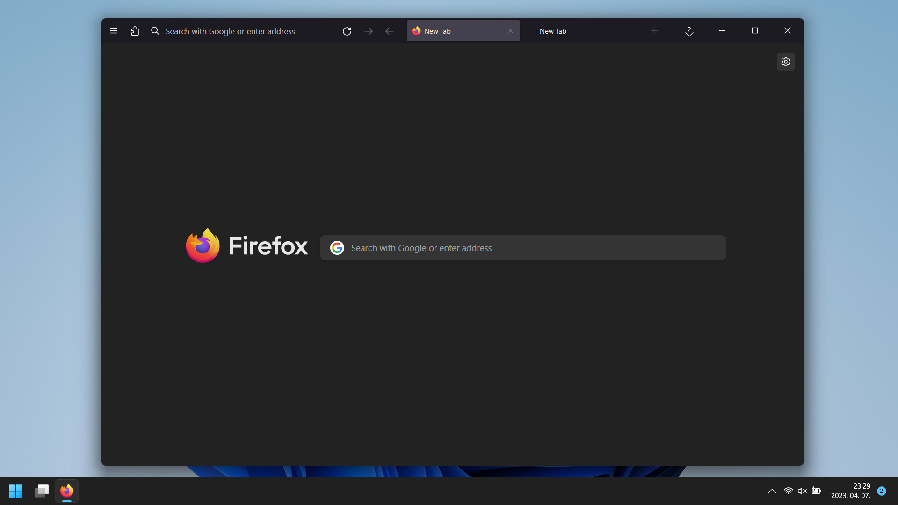
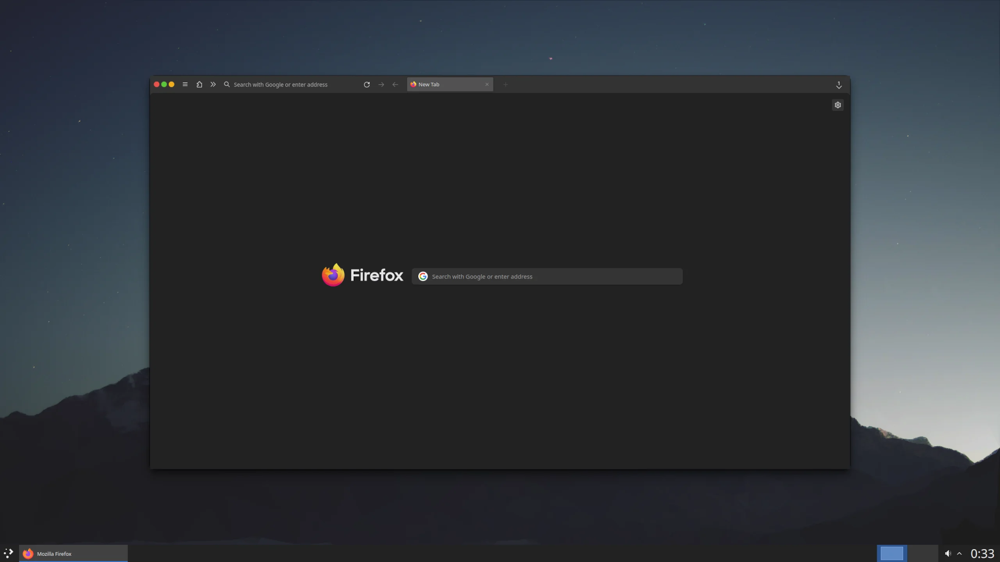

# How to install:

### Enable `toolkit.legacyUserProfileCustomizations.stylesheets`
1. Go to `about:config`
2. Click on *„Accept the Risk and Continue”*
3. Doubleclick on `toolkit.legacyUserProfileCustomizations.stylesheets` if it isn't already enabled

### Copy the CSS in your profiles chrome folder
1. Go to `about:profiles`
2. Find your profile  --  ( *„This is the profile in use and it cannot be deleted.”* )
3. Open the profiles root directory
4. Create a folder called `chrome`
5. Copy the preferred `userChrome.css` and `userContent.css` there

### Restart Firefox
1. Click on the X button
2. Doubleclick on the firefox icon

***

# Downloads:
## userChrome.css  --  Changes how the browser looks

#### Windows style buttons [Windows & Linux](https://github.com/Bali10050/FirefoxCSS/releases/download/(E)userChrome/userChrome.css)

Old versions if the new one doesn't work [Windows 11](https://github.com/Bali10050/FirefoxCSS/releases/download/(C)userChrome/userChrome.css) | [Linux](https://github.com/Bali10050/FirefoxCSS/releases/download/(B)userChrome/userChrome.css)

#### Macos style buttons [MacOS & Linux](https://github.com/Bali10050/FirefoxCSS/releases/download/(D)userChrome/userChrome.css)

#### Ultraminimal version [Linux](https://github.com/Bali10050/FirefoxCSS/releases/download/(A)userChrome/userChrome.css)

## userContent.css  --  Changes how the pages look

#### [All platforms](https://github.com/Bali10050/FirefoxCSS/releases/download/userContent/userContent.css)
